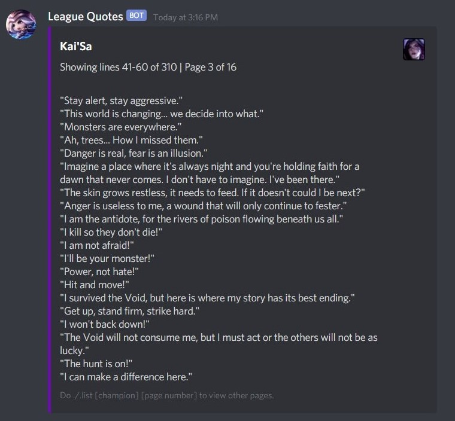

# League Quotes

League Quotes is a Discord bot made using Node.js and FFMPEG. It's the first and only Discord bot that I've made for my friend's server for fun.

## What it does.

League Quotes lets you play **all** League of Legends champion voice lines on Discord - from the *Star Guardian Ahri "Victory!"* line up to Aphelios' grunts, League Quotes can play them all for you!

## How does it work?

There are commands for users, and the bot will handle everthing for you. Start by joining a voice channel and using the command "play".
The bot gathered all voice line URLs from a wiki site for League of Legends, including champion names and champion icons. It stores all of those data in [data.json](./data.json).

Some URLs might already be outdated, and new champions might not be included in the list.

## Is it always online?

Sadly, the bot is not being hosted 24/7 since it was purely an experiment. The Bot Discord token is also hidden from other people, but the source code is there for everyone to use.